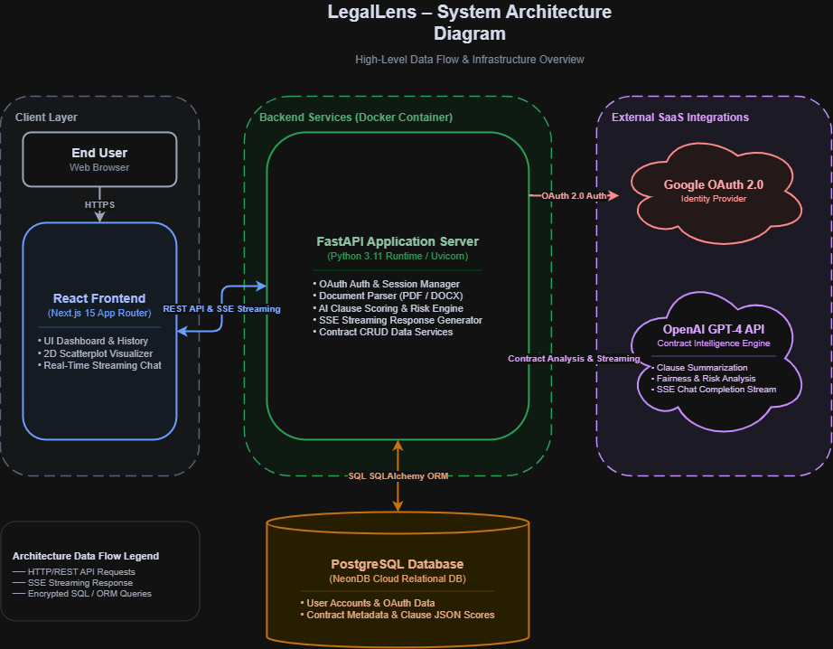
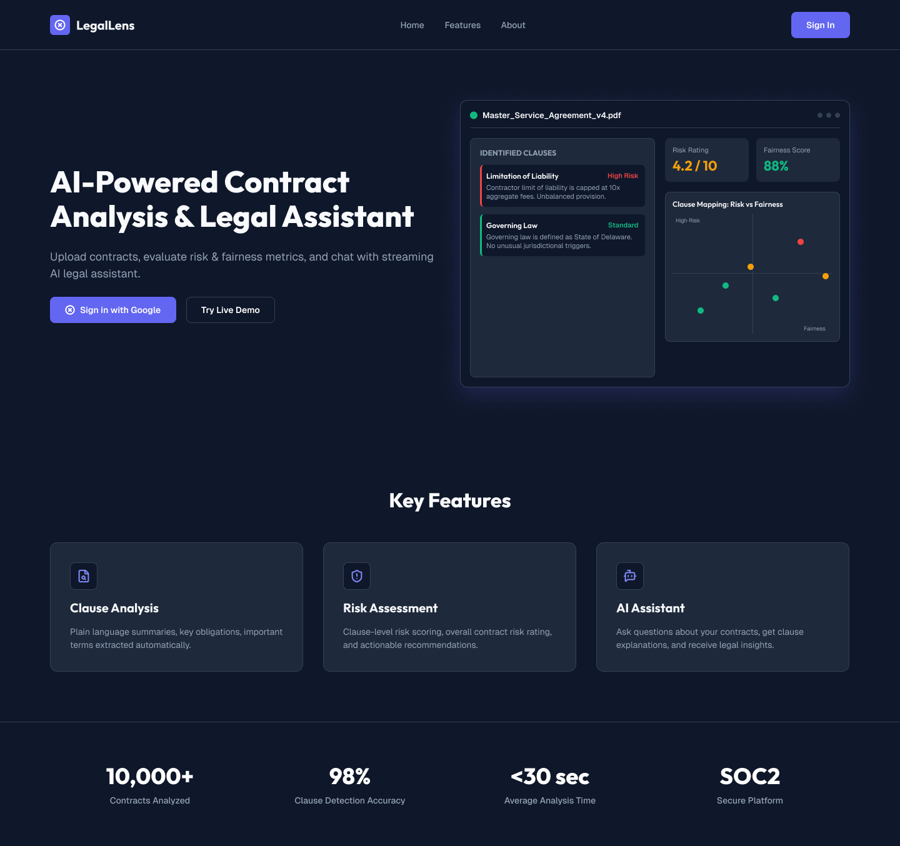
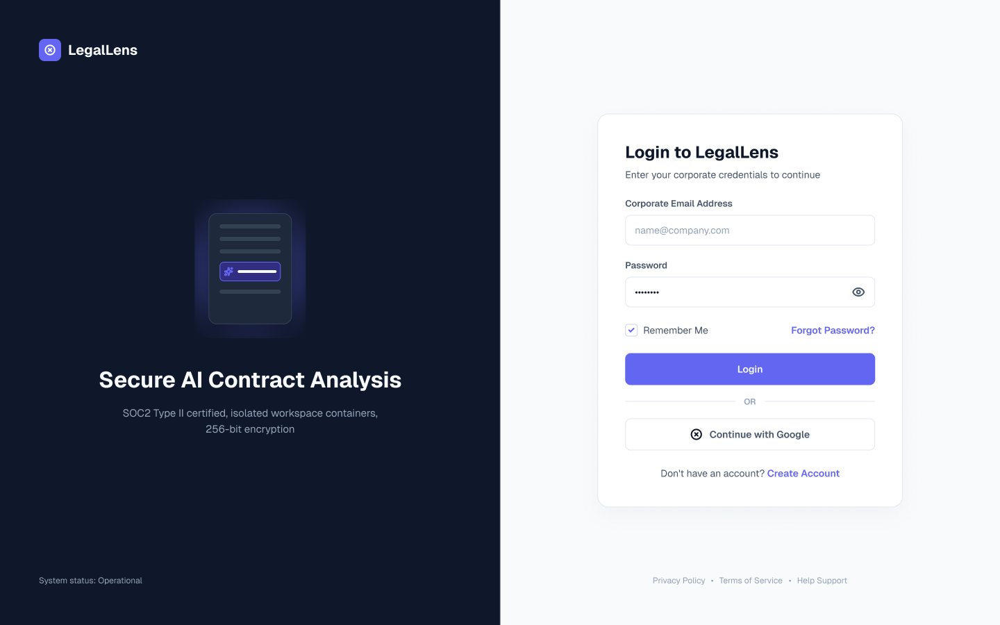
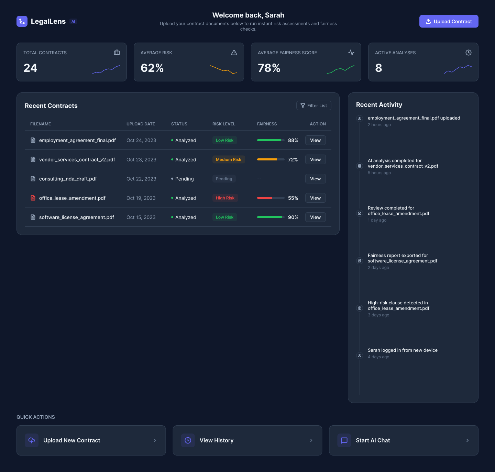
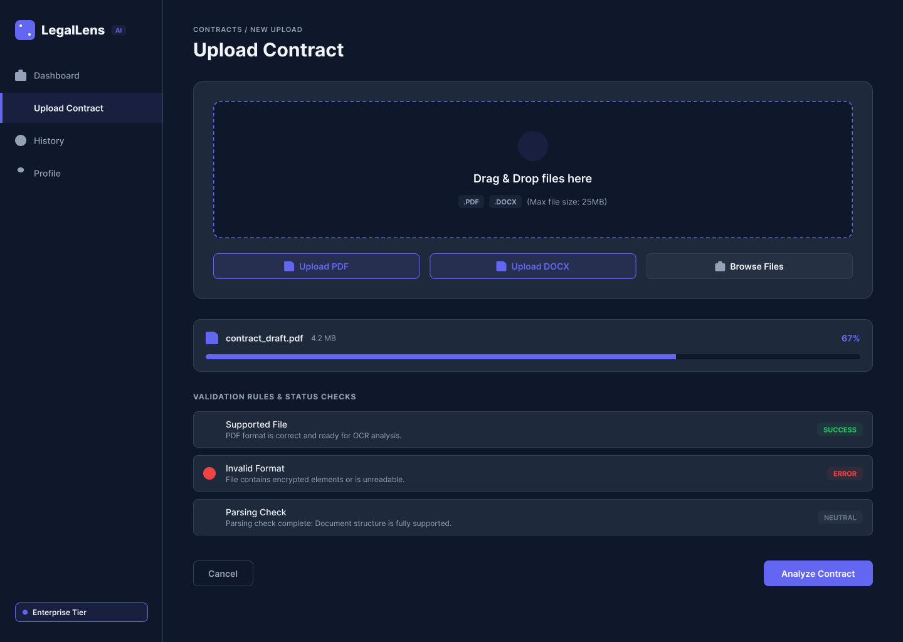
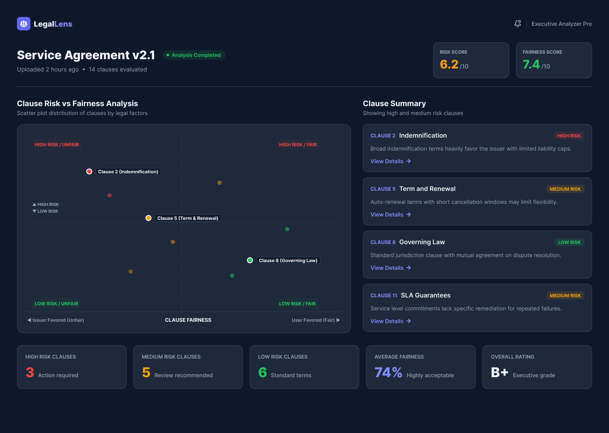
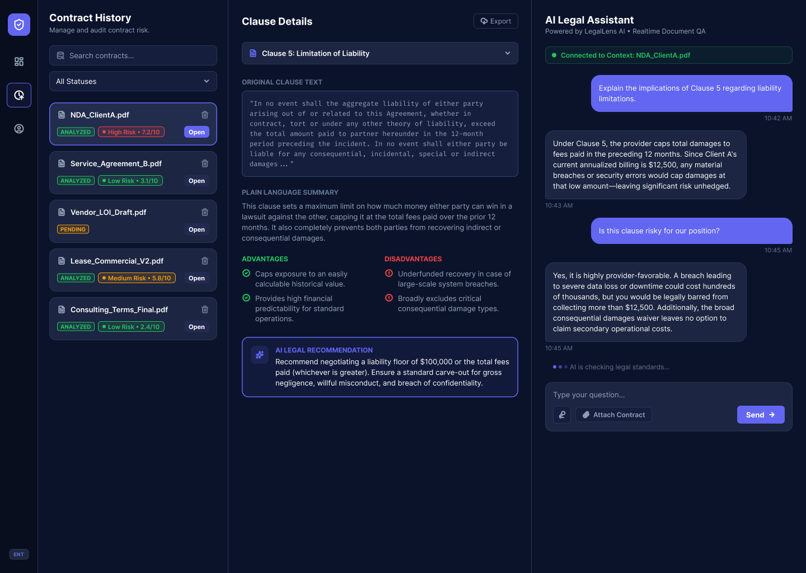

# 🔍 LegalLens – AI-Powered Contract Analysis & Legal Assistant

> **Tagline**: AI-Powered Contract Analysis and Legal Assistant

**LegalLens** is a web application that enables users to upload legal contracts (PDF/DOCX), analyze them using AI, generate clause summaries, evaluate clause risk and fairness, visualize analysis results, interact with an AI legal assistant, and manage previously analyzed contracts.

---

## 🚀 Features

- 📄 **Contract Document Upload**: Upload `.pdf` or `.docx` contracts with automated text extraction.
- 🧠 **AI-Powered Contract Analysis**:
  - **Summaries**: Concise one-line clause explanations.
  - **Pros & Cons**: Advantage and disadvantage analysis per clause.
  - **Fairness & Risk Scoring**: Scores each clause on fairness ($x$-axis: user vs. issuer) and risk level ($y$-axis: low vs. high).
- 📊 **Visual Clause Mapping**: Interactive 2D scatterplot mapping clauses by Risk vs. Fairness with hover details.
- 💬 **Streaming AI Legal Assistant**: Real-time streaming chat assistant (SSE) with context-aware contract intelligence.
- 🔐 **Document & Session Management**: Google OAuth 2.0 authentication, session persistence, and contract history dashboard.

---

## 🛠 Tech Stack & Architecture

### 🔹 Frontend
- **Framework**: [Next.js 15](https://nextjs.org/) (App Router), React 19
- **Styling**: [Tailwind CSS](https://tailwindcss.com/)
- **Data Visualization**: `@nivo/scatterplot`
- **Auth & State**: Arctic OAuth 2.0, HTTP-only cookie session management

### 🔸 Backend
- **Framework**: [FastAPI](https://fastapi.tiangolo.com/) (Python)
- **Database ORM**: [SQLAlchemy](https://www.sqlalchemy.org/) & PostgreSQL (NeonDB)
- **Document Extractors**: `pdfplumber` (PDF) and `python-docx` (DOCX)
- **AI Integration**: [OpenAI GPT-4 API](https://platform.openai.com/)

---

## 📐 Architecture & Software Design

### Summary of Main Design Choices
LegalLens implements a modular Layered Client-Server Architecture pairing Next.js 15 (App Router) with an asynchronous FastAPI backend for high-cohesion and low-coupling operation. Real-time streaming via Server-Sent Events (SSE) delivers AI clause analysis and chat responses with sub-second latency, avoiding heavy HTTP polling. Interactive 2D scatterplot visual mapping ($x$-axis: Fairness, $y$-axis: Risk) grants users immediate situational awareness of contract safety, while Google OAuth 2.0 and SQLAlchemy ORM enforce clean security and data layer decoupling.

---

### High-Level System Architecture Diagram
Editable Source Diagram: [`LegalLens_Architecture.drawio`](docs/design/LegalLens_Architecture.drawio)



---

### User Interface Design & Prototypes (Figma Screenshots)

#### 1. Landing Page


#### 2. Authentication & Login Page


#### 3. User Dashboard


#### 4. Contract Upload & Parsing Check


#### 5. Contract Analysis Dashboard (2D Risk vs. Fairness Scatterplot)


#### 6. Streaming AI Legal Assistant Dashboard


---

## 🌿 Branching Strategy (GitHub Flow)

LegalLens strictly enforces **GitHub Flow** for feature development. All major features, documentation, and performance enhancements are isolated in dedicated feature branches, reviewed, and merged into `main` via Pull Requests with Conventional Commits.

### Feature Branches

- `feature/documentation`: System architecture diagrams & README updates.
- `feature/authentication`: Google OAuth 2.0 flow & session management.
- `feature/document-upload`: PDF & DOCX file upload & parsing engine.
- `feature/ai-analysis`: OpenAI GPT-4 clause extraction & scoring.
- `feature/data-visualization`: Risk vs. Fairness 2D scatterplot & gauges.
- `feature/ai-chat`: SSE real-time streaming AI legal assistant.
- `feature/document-management`: Contract history dashboard & navigation.
- `feature/performance`: Sprint 3 performance optimizations & async queues.

---

## 🛠 Local Development Tools

The LegalLens project utilizes the following local engineering tools:

- **IDE**: [VS Code](https://code.visualstudio.com/) (Visual Studio Code)
- **Containerization**: [Docker Desktop](https://www.docker.com/products/docker-desktop/) (Docker Engine & Docker Compose)
- **Version Control**: [Git](https://git-scm.com/) & GitHub
- **Backend Runtime**: [Python 3.11+](https://www.python.org/) & [Uvicorn](https://www.uvicorn.org/)
- **Frontend Runtime**: [Node.js 20+](https://nodejs.org/) & `npm`
- **Database**: PostgreSQL (Cloud Hosted via [NeonDB](https://neon.tech/))
- **AI Engine**: OpenAI GPT-4 API

---

## 🚀 Quick Start – Local Development

You can run LegalLens locally using either **Docker Desktop** (recommended) or manual CLI setup.

### Prerequisites

1. Install [Docker Desktop](https://www.docker.com/products/docker-desktop/).
2. Create `backend/.env` with your OpenAI API Key:
   ```env
   OPENAI_API_KEY=your_openai_api_key_here
   ```

---

### Option 1: Run with Docker Compose (Recommended)

Run the entire application (Backend + Frontend) in containerized environments with a single command:

```bash
docker-compose up --build
```

- **Frontend App**: `http://localhost:3000`
- **FastAPI Backend API**: `http://localhost:8000`
- **API Swagger Documentation**: `http://localhost:8000/docs`

To stop containers:
```bash
docker-compose down
```

---

### Option 2: Manual Local Setup

#### 1. Backend Setup (FastAPI)

```bash
cd backend
python -m venv venv

# Activate Virtual Environment:
# On Windows (PowerShell):
.\venv\Scripts\activate
# On macOS/Linux:
source venv/bin/activate

pip install -r requirements.txt
uvicorn main:app --reload --port 8000
```

#### 2. Frontend Setup (Next.js)

Open a second terminal window:

```bash
cd frontend
npm install
npm run dev
```

Visit `http://localhost:3000` in your web browser.

---

## 📜 License

MIT License
